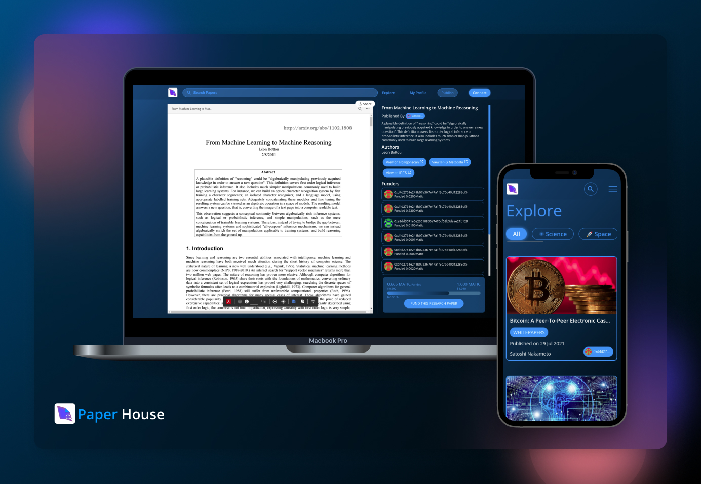
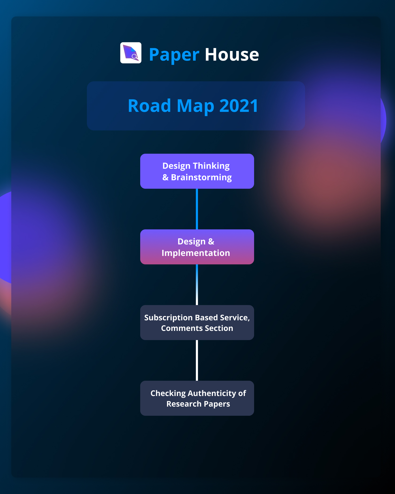

# Paper House

[](https://github.com/Paper-House/PaperHouse/blob/main/LICENSE) [](https://github.com/Paper-House/PaperHouse/issues) [](https://paper-house.netlify.app/)

An NFT Platform for Researchers. A place where a researcher can mint their research paper and publish and also get funded on our platform.



## Contents

- [What is Paper House?](#What-is-Paper-House?)
- [Getting Started](#Getting-Started)
- [Project Roadmap](#Project-Roadmap)
- [Live Demo](#Live-Demo)
- [Built With](#Built-With)
- [Contract Releases](#Contract-Releases)
- [Contributors](#Contributors)
- [License](#License)

## What is Paper House?

Much of the world is yet to be introduced to cryptocurrencies, DeFi, and NFTs. Our aim with this project is to onboard researchers and scholars to the world of crypto and introduce them to DeFi, Blockchain.

A Researcher can Mint and Publish their research papers on Paper House. Minting validates the research paper, keeping the originality of the paper linked safely with the Author, which would help prevent Piracy & duplication of Research Papers. Researchers can also be funded right on the same platform. Many research works get dropped due to lack of funding and support, Funding Research Papers on Paper House would motivate the researchers to carry forward the research work.

For scholars, Paper House is a one-stop platform that provides a simple way to broadly search for scholarly literature and also fund researches which have a great potential

In near future, we’re planning to add various features to our platform like Up-Vote & Down-Vote Papers, De-list paper from our home page, Get crypto rewards for reading research papers, and also much-needed features like Verifying the Authenticity of Research papers, Report Paper, Comments Section, Filter for adult content, Getting crypto rewards for reading research papers and Subscription-based on-demand service to get more insights about a research paper so that researchers can get monetized.

## Getting Started

### <p> <b> Installing React dependencies and starting local server </b> </p>

```
git clone https://github.com/Paper-House/PaperHouse.git
cd client/
npm install
npm start
```

<p align="center">OR</p>

```
git clone git clone https://github.com/Paper-House/PaperHouse.git
cd client/
yarn install
yarn start
```

## Project Roadmap



## Live Demo

Our Official Website: [Paper-House.netlify.app/](https://paper-house.netlify.app/).

## Built With

- [React](https://reactjs.org/) - React is a free and open-source front-end JavaScript library for building user interfaces or UI components.
- [Redux](https://redux.js.org/) - Redux is an open-source JavaScript library for managing application state.
- [Polygon (Matic Mumbai)](https://docs.matic.network/docs/develop/network-details/network/) - Mumbai Testnet replicates the Matic Mainnet, which is to be used for testing.
- [Metamask](https://metamask.io/) - MetaMask is a software cryptocurrency wallet used to interact with the Ethereum blockchain.
- [Portis](https://www.portis.io/) - Portis is a simplistic multi-blockchain wallet, which is designed to be easily set-up and connected to dApps.
- [The Graph](https://thegraph.com/) - The Graph is an indexing protocol for querying networks like Ethereum and IPFS. Anyone can build and publish open APIs, called subgraphs, making data easily accessible.
- [NFT Storage](https://nft.storage/) - Free decentralized storage and bandwidth for NFTs on IPFS and Filecoin.

## Contract Releases

- [Polygon Mumbai Testnet (80001)](https://mumbai.polygonscan.com)
- [View On Polygonscan](https://mumbai.polygonscan.com/address/0xEA1aC3a3c4B29F55D1271658e8c864B40a6c68E3)

```json
{
  "80001": {
    "PaperHouse": "0xEA1aC3a3c4B29F55D1271658e8c864B40a6c68E3"
  }
}
```

## Contributors

<a href="https://github.com/Paper-House/PaperHouse/graphs/contributors">
  
</a>

## License

This project is licensed under the MIT License - see the [LICENSE](LICENSE) file for details.
